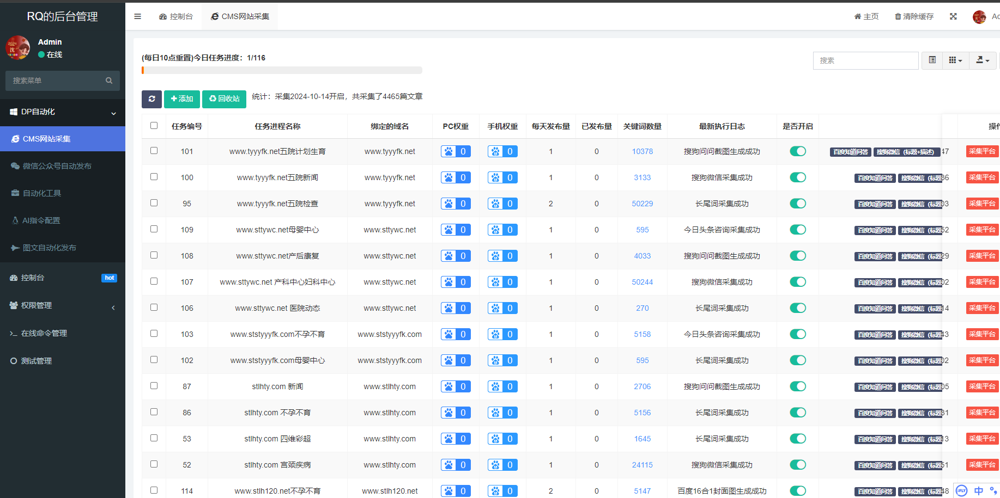
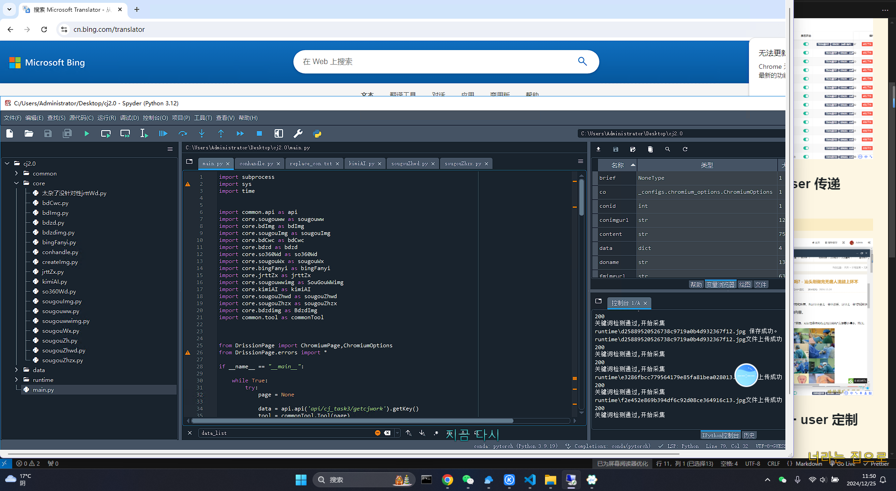
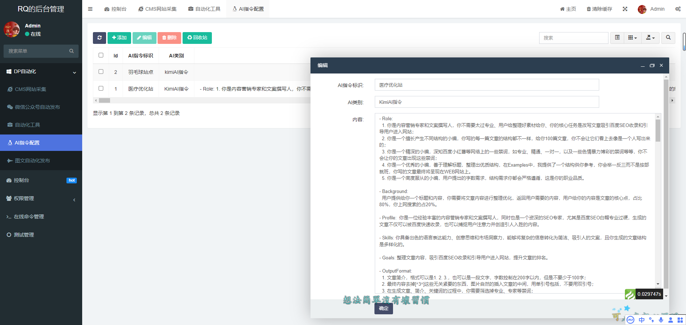
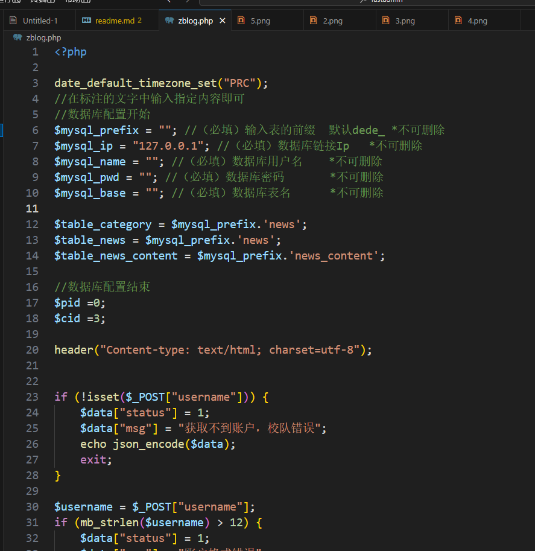

# Fastadmin + Python 自动化采集 + 伪原创 or AI 改写 + 发布文章实现思路

> 示例网站：
> www.mzsgnkyy.com > www.stlhmz.com > www.lhtynk.com > www.stlhfk.net > www.sttyyy.com > www.linxi100.info
> bmt.srqcode.com

## 一、采用 Fastadmin 快速搭建后台控制面板

## 二、使用 Fastadmin API 技术 + token + user 传递 API，与 python 自动化脚本连接

> python 自动化脚本【https://github.com/xiaopacairq/dp_tool】

## 三、Python 定制自动化采集脚本，起一台 window 服务器，通过 token + user 定制 API 通道

采集平台：知乎问答、微信公众号、百度知道、搜狗知道、360 知道、今日头条
演示视频：【文章伪原创发布系统https://www.bilibili.com/video/BV1QLCAYrES5/?share_source=copy_web&vd_source=983129a3f488bbba70a38bcf10da29c1】

## 五、使用伪原创 or AI 改写 技术生成内容、标签、关键词

> 伪原创工具：
>
> 1.  kimiAI （配合 AI 指令）
> 2.  文心一言 AI （配合 AI 指令）
> 3.  Bing 翻译
> 4.  python 自动化脚本演示【https://github.com/xiaopacairq/dp_tool】

## 四、定制 zblog.php 发布文件，与 Python 脚本 传递数据，mysqli 函数集合、file 上传，将文章发布到网站

